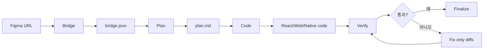

# Ddalkak

Ddalkak은 Figma URL을 입력하면 디자인 정보를 추출해 Bridge JSON으로 정리하고, 이를 기반으로 구현 계획, 코드 생성, 화면 검증까지 이어지도록 만든 퍼블리싱 자동화 플러그인입니다.

현재 기본 목표는 사람이 반복해서 퍼블리싱하지 않도록, Figma 디자인을 코드 생성 가능한 중간 표현으로 안정적으로 바꾸는 것입니다.

## 전체 흐름



| 단계 | 명령 | 입력 | 출력 | 설명 |
|---|---|---|---|---|
| 0 | `/ddalkak:design-md` | 프로젝트 코드베이스 | `design.md` | 기술 스택과 구현 기준을 정리합니다. |
| 1 | `/ddalkak:bridge` | Figma URL 1개 이상 | `.ddalkak/bridge/<name>.bridge.json` | Figma 디자인을 플랫폼 중립 Bridge JSON으로 변환합니다. 같은 화면의 상태 변형 프레임이면 여러 URL을 하나의 bridge로 병합합니다. |
| 2 | `/ddalkak:plan` | Bridge JSON, `design.md` | `.ddalkak/plan/<name>.plan.md` | 구현 계획을 만듭니다. |
| 3 | `/ddalkak:code` | Plan, `design.md` | 프로젝트 코드 | 실제 코드를 생성합니다. |
| 4 | `/ddalkak:verify` | 코드, Bridge JSON | `.ddalkak/reports/<name>.verify.md` | 생성 화면을 디자인 기준과 비교합니다. |
| 5 | `/ddalkak:finalize` | Verify 결과 | 최종 요약 | 완료 상태와 남은 이슈를 정리합니다. |

자세한 사용자 흐름은 [docs/ddalkak-user-flow.md](docs/ddalkak-user-flow.md)를 참고합니다.

앱 검증까지 확장하는 방식은 [docs/platform-verify.md](docs/platform-verify.md)를 참고합니다. 현재 구현된 캡처 provider는 Web과 Flutter(웹 빌드)이며 둘 다 Playwright로 캡처합니다. Flutter는 canvas 렌더링이라 DOM 스냅샷 없이 픽셀 비교만으로 판정합니다. Android Native, iOS Native, React Native는 `verify.targets` 계약을 먼저 정의하고 provider를 추가하는 구조입니다.

## Bridge가 하는 일

Bridge는 Figma와 코드 생성 단계 사이의 번역 계층입니다. Figma 원본을 그대로 코드로 만들면 Web, React Native, iOS, Android 같은 대상 환경마다 해석이 달라질 수 있으므로, 먼저 공통으로 읽을 수 있는 Bridge JSON으로 정리합니다.

Bridge JSON에는 다음 정보가 들어갑니다.

| 분류 | 포함 정보 |
|---|---|
| 구조 | page, section, frame, group, component, instance |
| 레이아웃 | bbox, size, auto layout, grid, gap, padding |
| 반응형 | constraints, sizing, adaptive group, breakpoint, matchKey |
| 스타일 | color, typography, radius, shadow, stroke, opacity |
| 텍스트 | content, font, line height, wrapping, overflow |
| 에셋 | image, icon, screenshot, export path, asset fit |
| 의미 | hero, card, button, input, navigation, list 같은 semantic role |
| 검증 | schema version, completeness, errors, confidence |

## 앱 검증 방향

Web과 Flutter(웹 빌드)는 브라우저에서 바로 스크린샷을 찍을 수 있지만, Android Native, iOS Native, React Native는 각 플랫폼의 실행 환경이 필요합니다. Ddalkak은 이를 `verify.targets`로 표현합니다.

```json
{
  "verify": {
    "defaultTarget": "web",
    "targets": [
      {
        "id": "web",
        "platform": "web",
        "screenshotProvider": "playwright",
        "entry": { "type": "url", "url": "http://localhost:5173" }
      },
      {
        "id": "ios-preview",
        "platform": "ios-native",
        "screenshotProvider": "simctl",
        "entry": { "type": "deepLink", "url": "ddalkak://preview?screen=home" }
      }
    ]
  }
}
```

즉 비교 엔진은 공통으로 유지하고, 화면을 띄워 스크린샷을 가져오는 부분만 플랫폼별 provider로 분리합니다. 앱 검증을 하려면 코드 생성 단계에서 `ddalkak://preview?screen=<name>` 같은 검수용 진입점도 함께 만들어야 합니다.

## 요구 사항

- Node.js 22 이상
- npm
- Claude Code
- Figma MCP 연결은 live 캡처를 할 때만 필요합니다.

캐시 기반 테스트만 돌릴 때는 Figma MCP가 없어도 됩니다.

## 빠른 시작

저장소를 받은 뒤 루트에서 의존성을 설치합니다.

```bash
npm install
```

샌드박스 앱 의존성도 설치합니다.

```bash
cd sandbox
npm install
cd ..
```

캐시 기반 Bridge 회귀 테스트를 실행합니다.

```bash
npm run test:bridge:cache
```

정상이라면 다음과 비슷한 결과가 나옵니다.

```text
bridge cache regression passed: 204 nodes, 10 assets
```

저장된 Figma 캐시를 사용해 샌드박스 프로젝트에 Bridge JSON을 생성합니다.

```bash
npm run bridge:cache -- --cache fixtures/figma/untitled-1-858 --project sandbox --name pc-home --force
```

정상 결과 예시는 다음과 같습니다.

```json
{
  "source": "cache",
  "mcpCalls": 0,
  "nodes": 204,
  "validation": "pass",
  "warnings": 0
}
```

생성된 파일은 다음 위치에서 확인할 수 있습니다.

```text
sandbox/.ddalkak/bridge/pc-home.bridge.json
```

샌드박스 화면을 실행하려면 다음 명령을 사용합니다.

```bash
cd sandbox
npm run dev
```

Vite가 출력하는 로컬 URL을 브라우저에서 열어 결과 화면을 확인합니다.

## Claude Code 플러그인으로 사용하기

Claude Code에서 이 저장소를 플러그인 디렉터리로 직접 로드할 수 있습니다. `<repo-path>`는 각자 clone 받은 Ddalkak 저장소의 절대 경로로 바꿉니다.

```bash
claude --plugin-dir <repo-path>
```

Claude Code 안에서 플러그인이 보이는지 확인합니다.

```text
/ddalkak
```

또는 마켓플레이스 방식으로 등록해 설치할 수 있습니다.

```text
/plugin marketplace add <repo-path>
/plugin install ddalkak@ddalkak-marketplace
```

스킬이나 agent 파일을 수정한 뒤에는 Claude Code에서 다시 로드합니다.

```text
/reload-plugins
```

## Figma MCP 연결

새 Figma 페이지를 live로 캡처하려면 Figma MCP가 필요합니다.

```bash
claude mcp add --transport http figma https://mcp.figma.com/mcp
```

Claude Code 안에서 연결 상태를 확인합니다.

```text
/mcp
```

Figma MCP 호출 한도 때문에 개발 중에는 다음 원칙을 사용합니다.

1. 처음 한 번만 live로 필요한 응답을 캡처합니다.
2. 모든 MCP 응답을 `fixtures/figma/<name>/` 또는 `.ddalkak/mcp-cache/<name>/`에 저장합니다.
3. 이후 extractor, schema, bridge 로직은 cache 모드로 반복 검증합니다.

## 캐시 기반 작업 방식

캐시가 완전한지 확인합니다.

```bash
node scripts/mcp-cache.mjs check fixtures/figma/untitled-1-858
```

캐시에서 Bridge JSON을 생성합니다.

```bash
npm run bridge:cache -- --cache fixtures/figma/untitled-1-858 --project sandbox --name pc-home --force
```

생성된 Bridge JSON을 검증합니다.

```bash
npm run validate:bridge -- sandbox/.ddalkak/bridge/pc-home.bridge.json
```

이 흐름은 MCP를 다시 호출하지 않습니다. 출력의 `mcpCalls`가 `0`이면 캐시 재생성 흐름으로 동작한 것입니다.

## 산출물 위치

기본 산출물은 대상 프로젝트의 `.ddalkak/` 아래에 저장됩니다.

```text
<project>/
  design.md
  .ddalkak/
    ddalkak.config.json
    bridge/
      <name>.bridge.json
    plan/
      <name>.plan.md
    reports/
      <name>.verify.md
```

## 주요 디렉터리

| 경로 | 설명 |
|---|---|
| `skills/` | Ddalkak 단계별 Claude Code skill입니다. |
| `agents/` | Figma 추출 등 하위 agent 정의입니다. |
| `shared/` | Bridge schema, pipeline 규칙, 공통 규칙 문서입니다. |
| `scripts/` | 캐시 검사, Bridge 생성, 검증 자동화 스크립트입니다. |
| `fixtures/figma/` | Figma MCP 응답을 재사용하기 위한 골든 캐시입니다. |
| `sandbox/` | 생성 결과를 실험하는 React 샌드박스입니다. |
| `docs/` | 데모와 사용자 설명 문서입니다. |

## 자주 쓰는 명령

```bash
npm run test:bridge:cache
npm run bridge:cache -- --cache fixtures/figma/untitled-1-858 --project sandbox --name pc-home --force
npm run validate:bridge -- sandbox/.ddalkak/bridge/pc-home.bridge.json
cd sandbox && npm run dev
```

## 현재 검증된 상태

캐시 `fixtures/figma/untitled-1-858` 기준으로 Bridge 생성이 검증되어 있습니다.

| 항목 | 결과 |
|---|---|
| MCP 호출 | 0회 |
| Bridge validation | pass |
| warnings | 0 |
| nodes | 204 |
| regression test | pass |

## 문제 해결

`node` 버전 오류가 나면 Node.js 22 이상인지 확인합니다.

```bash
node -v
```

Figma MCP가 연결되지 않으면 Claude Code 안에서 `/mcp`를 실행해 `figma`가 connected 상태인지 확인합니다.

캐시 검사에서 누락 node가 나오면 해당 Figma 페이지를 live 모드로 다시 캡처하거나, 부족한 node의 `get_design_context` 응답을 캐시에 보강해야 합니다. Ddalkak은 필수 데이터가 부족한 상태에서는 다음 단계로 넘어가지 않도록 막습니다.

## 팀 작업 규칙

역할과 PR 규칙은 [AGENT.md](AGENT.md)를 따릅니다. PR 또는 이슈 본문은 합니다체로 작성하고, 생성 도구 푸터는 넣지 않습니다.
