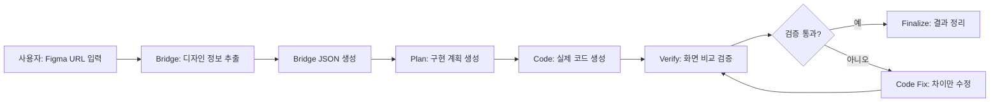
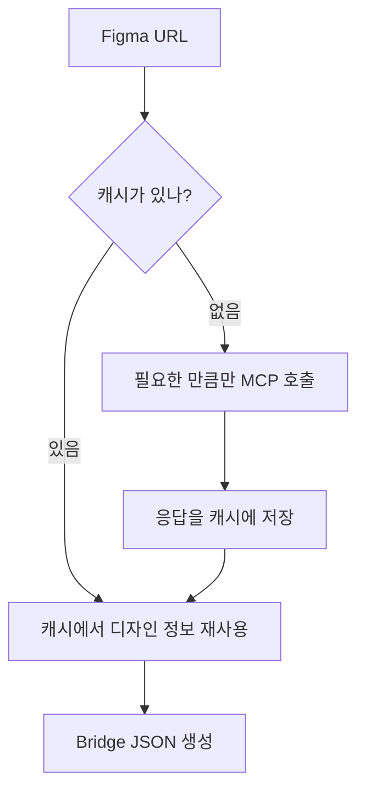
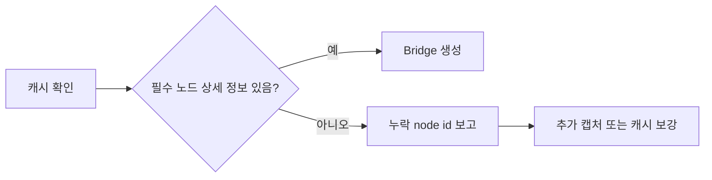

# Ddalkak 작동 흐름

이 문서는 다른 사용자나 팀원에게 Ddalkak이 어떻게 작동하는지 설명하기 위한 공유용 문서입니다. 핵심은 사용자가 Figma 링크를 넣으면, Ddalkak이 디자인을 중간 표현으로 변환하고, 그 결과를 바탕으로 구현 계획과 코드를 만든 뒤 검증까지 이어간다는 점입니다.

## 한 줄 요약

Figma URL을 입력하면 Ddalkak이 디자인 정보를 Bridge JSON으로 정리하고, 이를 기반으로 plan, code, verify 단계를 거쳐 퍼블리싱 작업을 자동화합니다.



## 사용자가 보는 흐름

1. 사용자는 Figma 화면 또는 섹션 URL을 준비합니다.
2. Ddalkak에 URL을 입력합니다.
3. Ddalkak은 Figma에서 레이아웃, 텍스트, 스타일, 에셋, 반응형 단서 등을 가져옵니다.
4. 가져온 디자인 정보를 플랫폼 중립적인 Bridge JSON으로 변환합니다.
5. Bridge JSON을 기준으로 구현 계획을 만듭니다.
6. 구현 계획에 따라 React, Web, Native 등 목표 환경에 맞는 코드를 생성합니다.
7. 생성된 화면을 Figma 기준 화면과 비교해 차이를 검증합니다.
8. 차이가 있으면 필요한 부분만 다시 수정하고, 통과하면 결과를 정리합니다.

## 내부 파이프라인

| 단계 | 이름 | 입력 | 출력 | 역할 |
|---|---|---|---|---|
| 0 | design-md | 프로젝트 코드베이스 | `design.md` | 사용할 기술 스택, 디자인 규칙, 구현 기준을 정리합니다. |
| 1 | bridge | Figma URL | `.ddalkak/bridge/<name>.bridge.json` | Figma 디자인을 코드 생성 가능한 중간 JSON으로 변환합니다. |
| 2 | plan | Bridge JSON, `design.md` | `.ddalkak/plan/<name>.plan.md` | 어떤 컴포넌트와 구조로 만들지 구현 계획을 세웁니다. |
| 3 | code | Plan, `design.md` | 프로젝트 코드 | 실제 화면 코드를 생성합니다. |
| 4 | verify | 코드, Bridge JSON | `.ddalkak/reports/<name>.verify.md` | 생성 결과와 디자인 기준의 차이를 확인합니다. |
| 5 | finalize | Verify 결과 | 최종 요약 | 완료 상태와 남은 이슈를 정리합니다. |

## Bridge가 중요한 이유

Bridge는 Figma와 코드 생성 단계 사이의 번역 계층입니다. Figma 원본은 Web, React Native, iOS, Android 같은 실행 환경에 바로 맞지 않기 때문에, 먼저 공통으로 이해할 수 있는 구조로 바꿔야 합니다.

Bridge JSON에는 다음 정보가 들어갑니다.

| 분류 | 예시 |
|---|---|
| 화면 구조 | page, section, frame, group, component, instance |
| 레이아웃 | width, height, x/y 좌표, auto layout, grid, gap, padding |
| 반응형 단서 | constraints, sizing, adaptive group, breakpoint, matchKey |
| 스타일 | color, typography, radius, shadow, stroke, opacity |
| 텍스트 | content, font, line height, wrapping, overflow behavior |
| 에셋 | 이미지, 아이콘, export 대상, asset fit |
| 의미 정보 | hero, card, button, input, navigation, list 같은 semantic role |
| 검증 정보 | screenshot 기준, 누락 데이터, confidence, errors |

즉 Bridge는 단순한 디자인 덤프가 아니라, 이후 AI가 코드를 안정적으로 만들 수 있게 정리된 설계 데이터입니다.

## MCP 호출을 줄이는 방식

Figma MCP는 계속 호출하면 한도와 속도 문제가 생길 수 있습니다. 그래서 Ddalkak은 cache-first 방식으로 동작합니다.



동작 기준은 다음과 같습니다.

| 모드 | 설명 |
|---|---|
| cache | 저장된 MCP 응답만 사용합니다. 추가 MCP 호출은 0회입니다. |
| live | Figma MCP를 호출하고 응답을 캐시에 기록합니다. |
| auto | 캐시가 있으면 재사용하고, 부족한 부분만 제한적으로 호출합니다. |
| refresh | 기존 캐시를 갱신합니다. |

개발 중에는 한 번 Figma 데이터를 충분히 캡처한 뒤, 이후에는 캐시 기반으로 Bridge를 다시 생성합니다. 그래서 schema나 extractor를 고쳐도 Figma를 계속 다시 호출하지 않고 빠르게 검증할 수 있습니다.

## 반응형 처리는 어떻게 하나요?

Bridge는 특정 화면 크기의 좌표만 저장하지 않습니다. 코드 생성기가 반응형 UI를 만들 수 있도록 다음 정보를 함께 기록합니다.

| 항목 | 목적 |
|---|---|
| constraints | 부모 기준으로 left, right, top, bottom, center 고정 여부를 판단합니다. |
| sizing | fixed, hug, fill, scale 같은 크기 동작을 표현합니다. |
| adaptive group | 같은 화면의 데스크톱, 태블릿, 모바일 변형을 묶습니다. |
| matchKey | 서로 다른 breakpoint에서 같은 역할을 하는 노드를 연결합니다. |
| textBehavior | 줄바꿈, 말줄임, 최소 높이, overflow 처리를 기록합니다. |
| assetFit | 이미지가 cover, contain, stretch 중 어떻게 배치되는지 기록합니다. |

이 덕분에 Bridge 결과는 단일 Web 화면뿐 아니라 React, React Native, iOS, Android 같은 다른 구현 대상에서도 재사용할 수 있습니다.

## 실패할 때의 처리

Ddalkak은 데이터가 부족한 상태에서 그럴듯하게 성공한 척하지 않습니다.

예를 들어 Figma 응답이 요약 정보만 있고 실제 leaf node 상세 정보가 부족하면, Bridge 단계에서 `meta.completeness`와 `meta.errors`에 누락 내용을 기록하고 다음 단계로 넘어가지 않도록 막습니다.



이 방식은 잘못된 코드가 생성되는 시간을 줄이고, 어떤 데이터를 더 가져와야 하는지 명확하게 알려줍니다.

## 결과물 위치

기본 산출물은 프로젝트의 `.ddalkak/` 아래에 저장됩니다.

```text
<project>/
  design.md
  .ddalkak/
    ddalkak.config.json
    bridge/
      <name>.bridge.json
    plan/
      <name>.plan.md
    reports/
      <name>.verify.md
```

## 데모에서 보여줄 포인트

1. Figma URL 하나를 넣으면 Bridge JSON이 생성됩니다.
2. Bridge JSON에는 단순 좌표가 아니라 반응형, 의미 정보, 검증 정보가 함께 들어갑니다.
3. 같은 캐시를 기반으로 extractor나 schema를 고쳐도 MCP 호출 없이 빠르게 재생성할 수 있습니다.
4. 데이터가 부족하면 성공 처리하지 않고, 어떤 node가 부족한지 보고합니다.
5. 이후 plan, code, verify 단계가 같은 Bridge JSON을 기준으로 이어집니다.

## 사용자에게 설명할 문장

Ddalkak은 Figma를 바로 코드로 찍어내는 도구라기보다, 먼저 Figma 디자인을 안정적인 Bridge JSON으로 바꿉니다. 이 Bridge가 레이아웃, 스타일, 반응형 단서, 에셋, 의미 정보를 담고 있기 때문에 이후 단계가 같은 기준을 보고 계획을 세우고 코드를 만들고 검증할 수 있습니다. 그래서 목표는 퍼블리싱을 사람이 직접 반복하지 않고, 디자인 입력부터 코드와 검증까지 이어지는 자동화 흐름을 만드는 것입니다.
