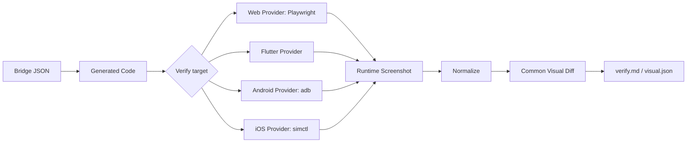

# Platform Verify

Ddalkak의 검증 단계는 Figma 기준 이미지와 실제 런타임 화면을 비교합니다. Web은 Playwright로 바로 캡처할 수 있지만, Flutter, Android Native, iOS Native, React Native는 각 플랫폼에서 화면을 띄우고 스크린샷을 가져오는 provider가 필요합니다.

핵심 구조는 다음과 같습니다.



## Verify Target

Bridge JSON은 `verify.targets`로 검증 대상 런타임을 표현합니다.

```json
{
  "verify": {
    "defaultTarget": "web",
    "targets": [
      {
        "id": "web",
        "platform": "web",
        "screenshotProvider": "playwright",
        "entry": {
          "type": "url",
          "url": "http://localhost:5173"
        },
        "viewport": { "w": 1440, "h": 900 }
      },
      {
        "id": "ios-preview",
        "platform": "ios-native",
        "device": "iPhone 15",
        "screenshotProvider": "simctl",
        "entry": {
          "type": "deepLink",
          "url": "ddalkak://preview?screen=home"
        },
        "viewport": { "w": 393, "h": 852 },
        "density": 3,
        "safeArea": { "top": 59, "right": 0, "bottom": 34, "left": 0 },
        "ignoreRegions": ["statusBar", "homeIndicator"]
      }
    ]
  }
}
```

현재 구현된 provider는 `web` + `playwright`입니다. Flutter, Android, iOS, React Native target은 schema로 표현할 수 있고 visual verify가 target을 읽지만, 실제 provider가 추가되기 전에는 실행 오류로 차단됩니다. 이 상태를 성공처럼 처리하지 않는 것이 원칙입니다.

## Platform별 책임

| 플랫폼 | Provider | 해야 할 일 |
|---|---|---|
| Web | `playwright` | URL을 열고 `body`를 캡처합니다. |
| Flutter | `flutter` | preview app 또는 integration test를 실행하고 스크린샷을 저장합니다. |
| Android Native | `adb` | emulator에 앱을 설치하고 deep link/activity를 열어 `screencap`을 저장합니다. |
| iOS Native | `simctl` | simulator에서 scheme을 실행하고 deep link를 열어 screenshot을 저장합니다. |
| React Native | `detox` 또는 `maestro` | 앱을 실행하고 test flow로 화면에 진입해 스크린샷을 저장합니다. |

## Preview Entrypoint

앱 검증이 가능하려면 코드 생성 단계가 검수용 진입점을 함께 만들어야 합니다.

예시:

```text
ddalkak://preview?screen=home
```

Android Native:

```bash
adb shell am start -W \
  -a android.intent.action.VIEW \
  -d "ddalkak://preview?screen=home"
```

iOS Native:

```bash
xcrun simctl openurl booted "ddalkak://preview?screen=home"
```

Flutter:

```dart
void main() {
  runApp(const DdalkakPreviewApp(screen: 'home'));
}
```

이 진입점이 없으면 로그인, 권한, 네트워크 상태, 앱 내부 route 때문에 원하는 화면까지 안정적으로 도달할 수 없습니다. 이 경우 verify 결과는 pass/fail이 아니라 blocked로 봐야 합니다.

## 공통 비교 엔진

플랫폼별 provider는 실제 화면 이미지만 만들어야 합니다. 이후 비교는 공통 엔진이 처리합니다.

공통 책임:

- baseline screenshot normalize
- actual screenshot normalize
- pixel diff
- bridge bbox 기준 region mismatch 집계
- `visual.json`, `verify.md` 생성

플랫폼 provider 책임:

- 앱 빌드 또는 실행
- 특정 preview 화면 진입
- screenshot 캡처
- density, safe area, system UI 차이 처리에 필요한 metadata 제공

## 현재 상태

현재 `scripts/visual-verify`는 `--target` 또는 `--platform`을 읽을 수 있습니다.

```bash
npm run visual:verify -- \
  --project sandbox \
  --name pc-home \
  --target web \
  --url http://localhost:5173
```

웹 target은 기존 Playwright provider로 동작합니다. 앱 target은 provider가 아직 없으면 명확한 오류로 중단됩니다.
