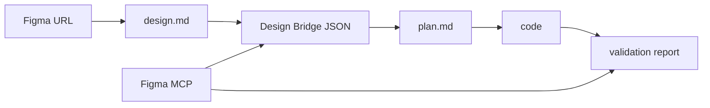

# 딸깍 Spec

## 목적

딸깍은 디자이너가 전달한 Figma URL을 기반으로, 개발자가 반복적으로 수행하는
디자인 분석, 구현 계획 수립, 코드 생성, 검증 과정을 Claude Code skill 모음으로
자동화하는 워크플로우다.

초기 형태는 Claude Code skill 모음이다. 필요하면 이후 CLI 또는 패키지 형태로
확장할 수 있지만, 현재 spec에서는 확정하지 않는다.

핵심 산출물은 다음 순서로 생성된다.

1. `design.md`
2. 디자인 브릿지 JSON
3. `plan.md`
4. code
5. validation report

각 단계는 독립 실행 가능해야 하며, 사용자는 단계별로 `skip` 또는 계속 진행을
선택할 수 있어야 한다.

## 확정된 전제

- 실행 타겟은 Claude Code다.
- 딸깍은 우선 skill 모음으로 제공한다.
- Figma MCP는 필수 전제다. Figma MCP가 없으면 딸깍은 해당 워크플로우를 지원하지
  않는다.
- Figma 범위 추출 모드 기본값은 `page`다.
- `design.md`는 팀 디자인/구현 컨벤션 문서다. Figma 디자인 원본을 요약하는 문서가
  아니다.
- 디자인 브릿지 JSON 스키마는 `shared/bridge.schema.json`을 단일 진실 소스로 따른다.
- code 생성 단계는 실제 파일 수정까지 수행한다.
- 필요한 경우 dependency 설치도 허용한다.
- 기존 코드베이스에 design system, shadcn/ui, 공통 component library, 스타일
  규칙이 있으면 우선 사용한다.
- 검증은 픽셀 diff 기반 지표를 제공해야 한다.
- 에이전트 코딩 결과의 목표 신뢰도는 95 이상이다.
- 최종 pass 판단은 도구가 제공한 지표를 바탕으로 사람이 한다.
- 검증 실패 후 자동 수정 루프는 기본 3회까지 수행한다.
- 자동 수정 루프 횟수는 옵션으로 조정 가능해야 한다.
- 담당자 또는 담당 후보 정보는 제품 spec이 아니라 내부 계획 문서에서 관리한다.

## 사용자 흐름

1. 디자이너가 개발자에게 Figma URL을 전달한다.
2. 개발자는 딸깍의 `design.md` 추출 skill로 `design.md`를 생성한다.
3. 개발자는 Figma MCP를 사용해 디자인 브릿지 JSON을 생성한다.
4. 개발자는 디자인 브릿지 JSON을 기반으로 `plan.md`를 생성한다.
5. 개발자는 `plan.md`를 검토하고, 확인되면 코드 생성 단계로 진행한다.
6. 개발자는 생성된 code가 Figma와 충분히 일치하는지 검증한다.
7. 개발자는 검증 결과가 충분한지 확인하고 마무리한다.

## 전체 파이프라인



## 산출물 저장 규칙

이 문서에서 "산출물"은 딸깍이 각 단계에서 생성하는 파일을 뜻한다.

기본 산출물:

- `design.md`
- `.ddalkak/bridge/<name>.bridge.json`
- `.ddalkak/plan/<name>.plan.md`
- `.ddalkak/reports/<name>.verify.md`
- `.ddalkak/ddalkak.config.json`

선택 산출물:

- Figma screenshot
- 구현 화면 screenshot
- 추출 asset
- 실행 로그 또는 run metadata

산출물 저장 위치는 `shared/pipeline.md`를 단일 진실 소스로 따른다.

대상 프로젝트 산출물 레이아웃:

```text
<project>/
  design.md
  .ddalkak/
    ddalkak.config.json
    bridge/
      <name>.bridge.json
    plan/
      <name>.plan.md
    reports/
      <name>.verify.md
```

동일 프로젝트에서 여러 Figma 페이지나 섹션을 처리해야 하는 경우에는 `<name>`으로
작업 단위를 구분한다.

`<name>`은 Figma 페이지 또는 섹션 이름을 kebab-case로 변환해 생성한다. 한 파이프라인
실행 내 모든 산출물은 동일 `<name>`을 공유한다.

## Skill 목록

### 1. design.md 추출 skill

프로젝트의 팀 디자인/구현 컨벤션을 `design.md`로 정리한다. 이미 `design.md`가 있으면
읽고 요약하며, 없으면 템플릿 기반 초안을 생성한다.

참고 포맷:

- Google Labs Code `design.md`: https://github.com/google-labs-code/design.md

입력:

- 기존 코드베이스
- 기존 팀 컨벤션 문서가 있는 경우 해당 파일

출력:

- `<project>/design.md`

포함해야 할 내용:

- 디렉터리 구조 규칙
- 컴포넌트 분해 기준
- 네이밍 규칙
- 스타일링 방식
- 디자인 토큰 사용 규칙
- 타이포그래피/색상/spacing 컨벤션
- responsive 기준
- 접근성 기준
- 금지 패턴
- 구현 시 주의사항

### 2. 디자인 브릿지 JSON 생성 skill

Figma MCP를 사용해 AI가 이해하기 쉬운 구조화 JSON을 생성한다.

입력:

- Figma URL
- `design.md`
- Figma MCP 결과

사용 MCP 도구 후보:

- `get_design_context`
- `get_screenshot`
- `get_metadata`

출력:

- `<project>/.ddalkak/bridge/<name>.bridge.json`

역할:

- Figma 원본 정보를 코드 생성과 검증에 적합한 JSON으로 정규화한다.
- 원본 Figma 구조를 `design.md`의 팀 컨벤션에 맞게 해석할 수 있도록 필요한 참조
  정보를 보존한다.
- 색상, 폰트, spacing, 컴포넌트 계층, 이미지, 아이콘, 상태, breakpoint 정보를
  포함한다.
- `shared/bridge.schema.json` 스키마를 반드시 따른다.

스키마 요약:

- `meta.figmaUrl`
- `meta.mode`
- `tokens`
- `screens`
- `assets`

### 3. plan.md 생성 skill

디자인 브릿지 JSON을 기반으로 구현 계획을 `plan.md`로 작성한다.

입력:

- `design-bridge.json`
- 기존 코드베이스 구조
- 프로젝트 기술 스택
- 팀 구현 컨벤션

출력:

- `<project>/.ddalkak/plan/<name>.plan.md`

포함해야 할 내용:

- 구현 대상 요약
- 수정 또는 추가할 파일 목록
- 컴포넌트 분해 계획
- 상태 관리 계획
- 스타일링 전략
- asset 처리 방식
- 접근성 체크리스트
- responsive 체크리스트
- 검증 방법
- 리스크와 논의 필요 사항

### 4. code 생성 skill

`plan.md`를 기준으로 실제 코드를 생성하거나 기존 코드를 수정한다.

입력:

- `plan.md`
- 기존 코드베이스
- 필요한 asset

출력:

- 코드 변경 사항
- 변경 요약
- 실행 또는 빌드 방법

요구사항:

- 기존 프로젝트 구조와 스타일을 우선한다.
- 기존 design system, shadcn/ui, 공통 component library가 있으면 우선 사용한다.
- UI 구현은 Figma와 시각적으로 일치해야 한다.
- 필요한 경우 기존 파일 수정과 dependency 설치를 수행할 수 있다.
- 생성 후 가능한 경우 로컬 실행 또는 빌드를 수행한다.
- 변경된 화면은 검증 skill이 사용할 수 있도록 접근 가능한 URL 또는 실행 방법을
  남긴다.

### 5. Figma 대조 검증 skill

생성된 code가 Figma와 같은지 검증한다.

입력:

- Figma MCP screenshot 또는 원본 이미지
- 구현 화면 screenshot
- `design-bridge.json`
- `plan.md`

출력:

- `<project>/.ddalkak/reports/<name>.verify.md`

검증 항목:

- 레이아웃 위치와 크기
- 색상
- 타이포그래피
- spacing
- radius
- shadow
- 이미지와 아이콘
- responsive 동작
- interaction 상태
- 접근성 기본 항목

검증 기준:

- 픽셀 diff 기반 지표를 필수로 제공한다.
- 목표 신뢰도는 95 이상이다.
- 도구는 pass 판단에 필요한 지표를 제공한다.
- 최종 pass 여부는 사람이 판단한다.
- 검증 실패 시 기본 3회까지 자동 수정 루프를 수행한다.
- 자동 수정 루프 횟수와 동작 방식은 옵션으로 변경 가능해야 한다.

검증 결과 형식:

```markdown
# Validation

## Summary

- Status: pass | needs-work | blocked
- Compared target:
- Compared implementation:

## Findings

| Severity | Area | Expected | Actual | Recommendation |
| -------- | ---- | -------- | ------ | -------------- |

## Follow-up

- [ ] ...
```

### 6. 마무리 검증 skill

전체 단계가 잘 완료되었는지 확인한다.

입력:

- `design.md`
- `design-bridge.json`
- `plan.md`
- 코드 변경 사항
- `validation.md`

출력:

- 최종 완료 여부
- 누락 산출물 목록
- 다음 단계 제안

### 7. skip 또는 계속 진행 skill

모든 단계에서 사용자가 현재 단계를 건너뛰거나 다음 단계로 진행할 수 있게 한다.

요구사항:

- 각 단계 시작 전 입력과 예상 출력물을 보여준다.
- 각 단계 종료 후 다음 행동을 선택하게 한다.
- 선택지는 최소 `continue`, `skip`, `stop`을 제공한다.
- `skip`한 단계는 이후 단계에서 명확히 표시한다.

## Figma 범위 추출 방식

딸깍은 두 가지 범위 추출 방식을 지원한다.

### section 기준 추출

Figma에서 선택한 section 또는 node를 중심으로 `design.md`와 디자인 브릿지 JSON을
생성한다.

장점:

- 특정 화면 또는 컴포넌트 구현에 적합하다.
- 불필요한 노드가 줄어든다.

주의사항:

- 주변 page context가 부족할 수 있다.
- 공통 토큰이나 전역 컴포넌트 정보가 누락될 수 있다.

### page 기준 추출

Figma page 전체를 기준으로 `design.md`와 디자인 브릿지 JSON을 생성한다.

장점:

- 화면 간 공통 패턴과 디자인 시스템 후보를 추출하기 좋다.
- page 단위 기능 구현 계획에 적합하다.

주의사항:

- 데이터가 커질 수 있다.
- 구현 대상이 아닌 노드를 걸러내는 규칙이 필요하다.

## 팀 컨벤션 design.md

팀 컨벤션 `design.md`는 선택 입력이다.

팀 컨벤션 파일이 있으면 다음 항목을 우선 적용한다.

- 네이밍 규칙
- 컴포넌트 분해 기준
- 스타일링 방식
- 디자인 토큰 명명 규칙
- 접근성 기준
- responsive 기준
- 금지 패턴

팀 컨벤션 파일이 없어도 기본 규칙으로 실행 가능해야 한다.

## 성공 기준

- Figma URL을 입력하면 단계별 산출물이 생성된다.
- Figma MCP가 없으면 지원하지 않는다는 오류를 명확히 보여준다.
- 사용자는 각 단계의 산출물을 검토하고 다음 단계 진행 여부를 선택할 수 있다.
- 디자인 브릿지 JSON은 `plan.md`, code, validation 단계에서 재사용 가능하다.
- 검증 결과는 픽셀 diff 기반 지표와 함께 pass, needs-work, blocked 중 하나로
  끝난다.
- code 생성 결과는 95 이상의 신뢰도를 목표로 한다.
- 각 단계는 실패 원인과 다음 조치가 명확해야 한다.

## 논의 필요 사항

1. `design.md` 추출 skill은 직접 구현할 것인가, Google Labs Code `design.md`
   포맷을 래핑할 것인가?
2. Figma URL만으로 범위를 자동 추론할 것인가, 사용자가 page 또는 section을
   명시해야 하는가?
3. 디자인 브릿지 JSON에서 Figma 원본 노드 ID를 모든 항목에 보존해야 하는가?
4. screenshot 파일은 로컬에 저장할 것인가, JSON에는 참조 경로만 둘 것인가?
5. asset 추출과 저장은 딸깍이 담당할 것인가, code 생성 단계가 담당할 것인가?
6. `plan.md` 생성 전에 사람이 반드시 검토해야 하는가, 아니면 자동으로 다음
    단계까지 진행 가능해야 하는가?
7. 지원할 초기 프레임워크 범위는 무엇인가?
8. 스타일링 방식 우선순위는 어떻게 둘 것인가?
9. 픽셀 diff 신뢰도 95 이상을 산정하는 구체 지표는 무엇으로 할 것인가?
10. 허용 오차 기준은 몇 px 또는 몇 %로 할 것인가?
11. 자동 수정 루프 옵션은 어떤 값을 제공할 것인가?
12. `skip`, `continue`, `stop` 선택은 Claude Code 대화 기반으로 처리할 것인가,
    상태 파일로도 남길 것인가?
13. 각 skill을 완전히 독립 실행 가능하게 만들 것인가, 오케스트레이터 skill도 둘
    것인가?
14. 서버 에이전트를 별도로 둘 것인가?
15. 서버 에이전트를 둔다면 담당 범위는 검증 자동화, Figma MCP 호출, asset 관리
    중 어디까지인가?
16. 최종 validation report를 로컬 markdown, PR 코멘트, GitHub Checks 중 어디에
    남길 것인가?
17. Figma URL, screenshot, extracted asset, run metadata 중 어떤 산출물을 영구
    저장할 것인가?
18. 저장하는 산출물에 민감정보가 포함될 수 있을 때 어떤 항목을 마스킹할 것인가?
19. 실패한 단계의 재실행은 동일 위치에 덮어쓸 것인가, revision을 남길 것인가?
20. 산출물 파일명은 고정할 것인가, 사용자가 변경 가능하게 할 것인가?
21. `design-bridge.json`을 사람이 읽기 좋은 pretty JSON으로 저장할 것인가,
    schema validation을 우선할 것인가?
22. 이 spec의 다음 단계는 skill별 상세 spec 작성인가, 아니면 MVP 구현인가?
